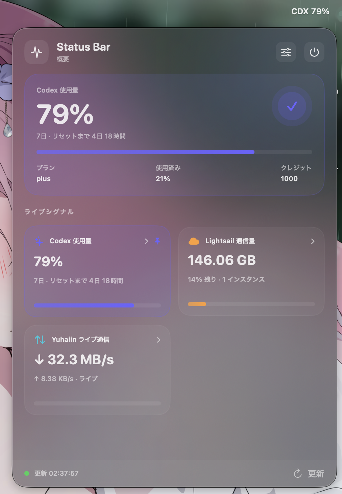

# Status Bar

Status Bar is a lightweight macOS menu bar monitor for three kinds of data:

- Codex quota and rate-limit windows
- AWS Lightsail transfer usage
- Yuhaiin live upload/download traffic

It runs as a menu bar accessory, so there is no Dock icon or background server
to manage. Choose one metric for the menu bar, or let the app rotate through
all providers that currently have data.

<p align="center">
  
</p>

## Requirements

- macOS 13 Ventura or later
- A Mac with the Swift compiler available (`swiftc`); Xcode Command Line Tools
  are sufficient for local builds
- Optional: Codex CLI authentication, AWS credentials, and/or a running
  Yuhaiin management API, depending on which cards you want to use

## Install

### Download a release

Published builds are available from the
[GitHub Releases](https://github.com/Asutorufa/macos-menubar-monitor/releases)
page. Unzip `StatusBar-<version>.zip`, move `StatusBar.app` to Applications,
then open it.

The app is currently ad-hoc signed. macOS may ask you to confirm the first
launch in System Settings → Privacy & Security.

### Build from source

```sh
git clone https://github.com/Asutorufa/macos-menubar-monitor.git
cd macos-menubar-monitor
./build.sh
open build/StatusBar.app
```

`build.sh` compiles the Swift sources, copies the app resources, validates the
property list, and creates an ad-hoc signed `build/StatusBar.app` bundle.

## First-time setup

1. Launch Status Bar. Its current metric appears in the macOS menu bar.
2. Click the menu bar item and open Settings using the sliders button.
3. Choose the metric or `Rotate metrics` that should be displayed in the menu
   bar.
4. Configure the providers you use, then choose **Save & refresh**.
5. Click any dashboard card to open its detailed view. Use the refresh button
   in the lower-right corner to fetch all visible providers immediately.

The dashboard refreshes every provider while it is open. When it is closed,
only the metric shown in the menu bar is refreshed, which reduces unnecessary
requests. Rotation keeps all providers active.

## Configure providers

### Codex

Codex is ready automatically when the app can read a valid Codex CLI auth file
at `~/.codex/auth.json`. The file must contain an access token and account ID.

For another launch environment, provide both variables instead:

```sh
CODEX_TOKEN="..." CODEX_ACCOUNT="..." open build/StatusBar.app
```

The Codex card shows the primary and secondary rate-limit windows, remaining
percentage, reset time, credits, and account information. The app reads the
usage endpoint directly from `chatgpt.com`; it does not ask you to paste the
token into Settings.

### AWS Lightsail

Open Settings → AWS Lightsail. You can provide credentials in any one of these
ways, in this order:

1. Access Key ID and Secret Access Key in Settings
2. `AWS_ACCESS_KEY_ID` and `AWS_SECRET_ACCESS_KEY`
3. The selected profile in `~/.aws/credentials`

An optional session token is supported through Settings or `AWS_SESSION_TOKEN`.
The profile selected by `AWS_PROFILE` takes precedence over the profile field
in Settings.

Region resolution follows this order:

1. Region in Settings
2. `AWS_REGION`
3. `AWS_DEFAULT_REGION`
4. The selected profile's region in `~/.aws/config`
5. `ap-northeast-1`

The AWS card reads instance metadata and the current month's `NetworkIn` and
`NetworkOut` metrics directly from Lightsail. It does not call the separately
charged Cost Explorer API.

The IAM identity only needs permission to read Lightsail instances, bundles,
and instance metrics. AWS SSO and `credential_process` profiles are not
supported by the direct client yet.

### Yuhaiin

The default management endpoint is:

```text
http://127.0.0.1:50051
```

If your Yuhaiin endpoint is different, enter it in Settings. If authentication
is enabled, enter the Basic token; the app adds the `Basic ` prefix when it is
missing. The card uses the management API's total connection counters to show
current download/upload rates and cumulative totals.

## Settings and refresh rates

Each provider has its own refresh interval. Defaults and accepted ranges are:

| Provider | Default | Allowed range |
| --- | ---: | ---: |
| Codex | 300 seconds | 30 seconds–24 hours |
| AWS Lightsail | 600 seconds | 60 seconds–24 hours |
| Yuhaiin | 5 seconds | 1 second–1 hour |
| Rotation | 8 seconds | 2–60 seconds |

The app also supports English, Traditional Chinese, Japanese, and Korean. The
initial language follows the preferred language in macOS and can be changed in
Settings.

## Data storage and security

- Non-sensitive preferences are stored in
  `~/Library/Application Support/StatusBar/settings.json`.
- Yuhaiin and AWS secrets are stored together in the macOS Keychain and are
  not written to `settings.json`.
- AWS requests use native HTTPS and SigV4 signing; the app does not invoke the
  AWS CLI.
- Provider requests are made only when a provider is active or the dashboard is
  open.

## Release a build

Pushing a version tag starts the GitHub Actions release workflow:

```sh
git tag v0.1.0
git push origin v0.1.0
```

The workflow builds a universal macOS app for both Apple silicon (`arm64`) and
Intel (`x86_64`), creates
`StatusBar-v0.1.0.zip`, generates `SHA256SUMS`, and uploads both to the GitHub
Release. It can also be started manually from Actions with a tag such as
`v0.1.0`.

## Troubleshooting

### A card says “Not configured”

Open Settings and check the provider-specific values. For Codex, verify that
`~/.codex/auth.json` exists and contains both required token fields. For AWS,
verify the selected profile and its region. For Yuhaiin, verify that the
management API is reachable at the configured URL.

### A card says “Read failed”

Open the card for the detailed error, then use refresh again. Common causes are
expired Codex authentication, missing AWS IAM permissions, an incorrect AWS
region, or a stopped Yuhaiin service.

### The app does not open after downloading

Because releases use ad-hoc signing, macOS may block the first launch. Open
System Settings → Privacy & Security and allow `StatusBar.app`, then launch it
again.

## Project layout

This is a dependency-free Swift app built directly with `swiftc`:

- `AppDelegate.swift` — menu bar item, floating panel, and refresh lifecycle
- `Views.swift` — dashboard, details, and Settings UI
- `Providers.swift` — Codex and Yuhaiin providers
- `AWSClient.swift` — AWS credential resolution, SigV4 client, and Lightsail
- `Configuration.swift` — preferences and Keychain storage
- `Models.swift` — shared settings and metric models
- `build.sh` — local app bundle build script

Contributions are welcome. Please keep provider logic independent from the UI
so new metrics can be added without changing the menu bar or Settings flow.
